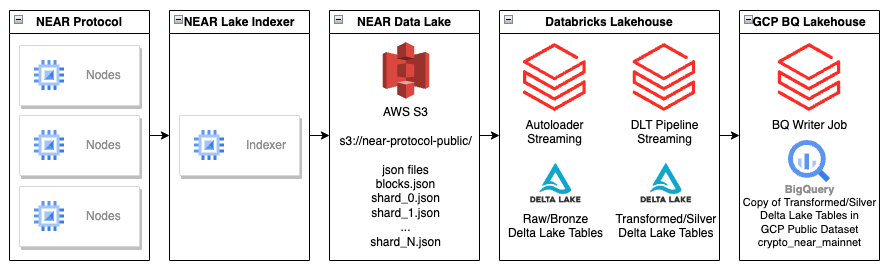

# near-public-lakehouse

NEAR Public Lakehouse

This repository contains the source code for ingesting NEAR Protocol data stored as JSON files in AWS S3 by [near-lake-indexer](https://github.com/near/near-lake-indexer). The data is loaded in a streaming fashion using Databricks Autoloader into raw/bronze tables, and transformed with Databricks Delta Live Tables streaming jobs into cleaned/enriched/silver tables.

The silver tables are also copied into the GCP BigQuery Public Dataset.

# Architecture

Note: [Databricks Medallion Architecture](https://www.databricks.com/glossary/medallion-architecture)

# What is NEAR Protocol?
NEAR is a user-friendly, carbon-neutral blockchain, built from the ground up to be performant, secure, and infinitely scalable. It's a layer one, sharded, proof-of-stake blockchain designed with usability in mind. In simple terms, NEAR is blockchain for everyone.

# Data Available
The current data that we are providing was inspired by [near-indexer-for-explorer](https://github.com/near/near-indexer-for-explorer/). 
We plan to improve the data available in the NEAR Public Lakehouse making it easier to consume by denormalizing some tables. 

The tables available in the NEAR Public Lakehouse are:
- **blocks**: A structure that represents an entire block in the NEAR blockchain.
- **chunks**: Chunk is a fraction of each block produced as a result of sharding in the NEAR protocol.
- **transactions**: A transaction in Near is a list of actions and additional information.
- **receitps**: All cross-contract (we assume that each account lives in its own shard) communication in Near happens through Receipts. Receipts are stateful in a sense that they serve not only as messages between accounts but also can be stored in the account storage to await DataReceipts.
- **account_changes**: Each account has an associated state where it stores its metadata and all the contract-related data (contract's code + storage).

# Examples
- Queries **TODO**
- Notebooks **TODO**

# References
- https://nomicon.io/
- https://docs.near.org/concepts/basics/protocol
- https://github.com/near/near-lake-indexer
- https://github.com/near/near-indexer-for-explorer/
- https://docs.gcp.databricks.com/ingestion/auto-loader/index.html
- https://www.databricks.com/product/delta-live-tables
